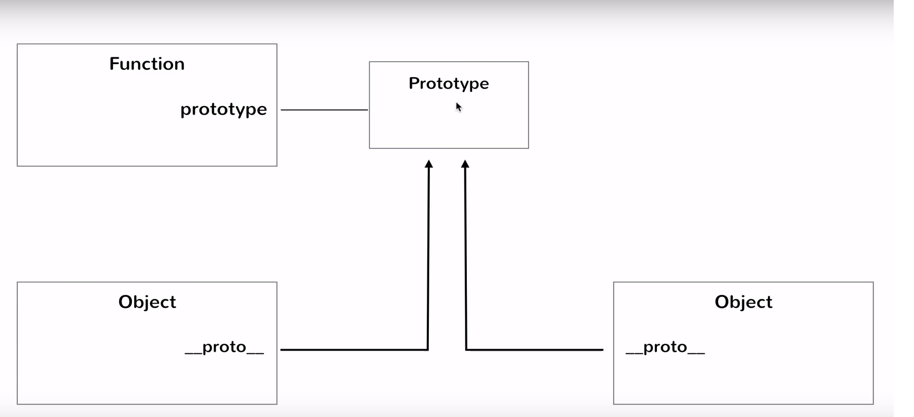

## recap-java-script https://github.com/getify/You-Dont-Know-JS
Repository to revise and document  javascript

* Lightweight (easy to implement)
* Interpreted (Instructions are executed direcly, but it does compiliation just before executing to gather some details)
* Object Oriented (We can design and write our code in terms of class and Objects)
* first-class functions (functional programming: functions can be used as value, Functions can be assigned to a variable)
* scripting language (Instructions are given and executed in linear order, but it can be bundled into a file and executed)

#### Runtime environments for Java Script
* Web Browser
* ???

#### Popular Frameworks

##### Client Side
* Jquery
* React
* Angular
* Ember

##### Server Side
* NodeJS
* Express

#### Specification
* ECMA 6

##### Inbuilt Java Script Functions

* prompt("message") : Opens a dialog box with the specified message and wait for user input.
* alert("message") : Opens a dialog box and display the message.
* console.log("message") : log the messages on console.

#### Datatypes

##### Primitive
* Number (64 bit floating value)
* String (16 bit unicode value)
* Boolean (true / false)
* Undefined (only undefined value. It is when we declare any variable and not assign any value)
* Null (only null value. This value can be assigned to any variable, when the actual value is not known.  typeof null shows null, but it is an existing bug)
* Symbol (Added in ECMA 6)

##### Non Primitive
* Array
* JSON
* Object

###### typeof 
* It is used to check the data type of variable or directly value.

```
var name = "neeraj"

typeof name;
```

#### == vs ===

* When we use == to compare two values, javascript do type conversion if the two values are not of same type and then does the comparison. ``` 10 == "10" will return true ```

* === does right comparison. ``` 10 = "10" will return false ```
* in case of object use === to check if both Objects points to same location.

##### Boolean value : Values of all types has as associated boolean value.
* If we use non zero value in if condition then it will always return true.. for zero it will return false.
* If we use non empty string in if condition then it will always return true... otherwise it will return false.
* null or undefined will also return false.

#### Variable Declaration & Definition

* var variableName; (Declaration)
* var variableName = value; (Definition)
* varibaleName = value (assignment... variable is already declared)
* At any time of script or program, we can change the variable value with **ANY DATA TYPE** (LOOSE TYPING).

#### Arrays
* Can have hetrogeneous elements.

```
var movies = ['Me Before You',"Marry Poppins Returns", 'A star is born', 'Bohemian Rhapsody'];
var myArray =[10,20,30,40];
```

###### Accessing Array elements
*  myArray[index]

###### Adding variable to Array
* myArray[4] = 50;

###### Array methods 
* push(60);  // Add element to the last and returns the updated length of the array.
* pop(); 	 // Removes last element from an array and returns it back.
* shift()	 // Removes first element from an array and returns it back.
* unshift(70) // Add element at the start of array and returns the updated length of the array.

######  Getting length of array
* arrayVariable.length

###### Iterating an array and applying function on array values
```
forEach function also take 2 hidden arguments which are **index** and **array** itself.

movies.forEach(function(movie){
	console.log(movie);
	}
);

	OR
	
movies.forEach(movie => console.log(movie));

	OR
for (var movie of movies){
    console.log(movie);
}

```
#### Objects
* Don't have classes( JavaScript is not class based programming language)
* Free Form as not bound to classes (properties  or functions can be added to Object on the fly(dynamixally) and even after creating its object)
* Object Creation
	*	var myObj = {} // Empty Object
	*   myObj.name = "neeraj"; // Added property to myObj Object after object creation.
	*	upfront creating Object
		```
			var employee = {
				"firstName": "John",
				"lastName" : "Jones",
				"salary"   : 56600,
				"vegetarian" : true			
			}		
		```
* Accessing Object property
	* can be accessed by either dot (.) notation or square brackets([])
	* Special cases of  square brackets([]) notation
		* Property name is a reserver word.
		* Property name starts with a number. eg myObj["1"];
		* Property name is dynamic.	(when property name is stored in a variable)		
			```
			myObj = {
				"name": "Neeraj",
				"age" : 23,
				"objProp": {
					"innerProp": "Inner Property Value"
					}			
			}
			var propertyName = "age";
			myObj[propertyName] // through variable
			myObj["age"]	// directly			
			```	
	* object.propertyName
	* if the property doesn't exist for an Object, then undefined value will be returned.
* Removing property from an Object
	* delete object.property eg person.age

#### Functions

* declared with function keyword.
* can be called with variable number of arguments(less or more than the declared arguments in function)
* If less function arguments are passed then the missed argument will have undefined value.
* If more function arguments are passed, then additional arguments will be ignored.
* return type doesn't need to be specified in the fucntion signature
* return value can be empty. eg return; if there is no return statement in function, then function returns an undefined value;
* functions can be passed as an arguments. 
* functions can have parameter with default values.
* function declaration can be assigned to a variable.
* functions are internally objects. It internally create two objects(object iteslf and it's prototype accessed by **prototype** property)

```
	var functionVariable = function doSomething(){
		console.log("Hello");
	};
	functionVariable(); // this will execute the function.
```

###### Anonymous function
```
	var functionVariable = functio(){
		console.log("Hello");
	};
	functionVariable();
```
###### Passing function as arguments
```
var f = function(name){
	console.log("Hello " + name);
}

var executor = function(fn,name){
	fn(name);
}

executor(f,"Neeraj");

```

###### Default arguments in functions
* **this**
* arguments

###### Varargs in functions (accessed through implicit ```arguments``` variable)
* arguments is like an array, but not an array

```
var add = function () {
	var i,sum = 0;
	for(i=0; i<arguments.length;i++){
		sum += arguments[i];
	}
	return sum;
}

```

###### Functions in Objects

```
var person = {
	"firstName":"Neeraj",
	"lastName" : "Mahajan"
	"getFullName" : function() {return person.firstName + person.lastName} // this instruction will be executed when getFullName function is called.

}

// Above implementation is not good

var person = {
	"firstName":"Neeraj",
	"lastName" : "Mahajan"
	"getFullName" : function() {return this.firstName + this.lastName} // this points to the current object.

}


var person = {
	"firstName":"Neeraj",
	"lastName" : "Mahajan",
  "address"  : {
    "houseNo" : 50,
    "street"  : "Mark Road",
    "city"    : "Southampton"  
  },
  "isFromCity" : function(city){
    return city === this.address.city;
  }
	
}

console.log(person.isFromCity("Southampton"));
```

#### Scopes in Java
* Dictates where the variable is accessible in the program.
* Global scope (Best practice is to not use global variable)
* function level scope (variables created inside function will not be visible outside directly)
* Following statements will create global scope
```
var age = 50;

{
	var a = 10;
}

if (true) {
	var b =20;
}
```
* function f has access to global x variable and will overried the value of x. will print 20 then 10
```
var x =20;

function f(){
  x =10;  // will modify original x variable.
}

console.log(x);
f();
console.log(x);
```
* executing anonymous function inline IIFE - immediately invoked function -- wrap function inside () and then call with () as shown below.
```
(function (){
	console.log("hi");
}
)();
```

###### Reading/Writing variables
* Reading a varibale without declartion will given exception. eg ``` console.log(foo) ```
* However write to variable will work without variable declaration. eg ``` foo = 10; console.log(10)```
* If a variable is create var anywhere in the program(even in fucntion) then it will create global scope. Below code will print 100
```
	function f(){
	  z = 100;
	}
	f();
	console.log(z);
```

###### Global object
* holds all global variables.
* depends on the runtime environment (eg **window** will be the global object in case of web browser) 

###### Compilation / Interpretation in javascript
* compilation happens just before execution.
* In compilation phase compiler scan all variables and defines thier global and local scope.
* All variables declared outside functions are put into global phase by compiler.
* Varibale declared without keyword **var** inside functions during write operation are put into global scope, but by **interpretor** 
* Separate local scope is created for each function.
* no assignment is done in compilation phase.
* assignment to varibale is done in execution phase.
* Below code will print value of c as undefined instead of 10, because of compilation and interpretation phase. ** IMPORTANT see b is declare in the inner method scope after the assignment**
```
function outer(){
 var b = 10;
  	
  	console.log(b);
  	function inner(){
 	 	var c = b;
  		console.log(c);
  		var b = 200;
  	}
 }
 outer();
```
* Below code will also print undefined
```
console.log(x);
var x =100;
```

###### Hoisting
* moves up the function definition or variable declarations at the top.

```
Will not work

fnA()

var fnA = function(){
	console.log("Hello")
}
```

```
Will work because javascript does the hoisting..
hello();
function hello(){
	console.log("Hello")
}
```

###### Strict Mode
* It runs the code in strict mode. In this mode you cannot create a varible name without declaring it with var keyword.
* To run in strict mode add **"use strict";** at top

#### Closures
* A closure is a feature in JavaScript where an inner function remember the value of variable in outer function scope or in global scope, even when the inner function is executed out of outer function context. In below code snippet, when innerFn is executed, the outer function scope doesn't exist any more, however innerFn has remembered the value of variable b which was declared in outer function.

```
var a = 10;

function outer(){
	var b = 20;
	var inner = function(){
		console.log(a);
		console.log(b);
	};
	return inner;
}

var innerFn = outer();
innerFn();

```

###### setTimeout(fn, milliseconds)
* This function takes a function and execute it after the passed milliseconds. It is an example function which shows the usage of closures, If the function passed has  used some variables, then it will be remembered in the library of setTimeout which will execute the function.
* how setTimeout works in a loop ????? TODO

```
var a = 10;

var fn = function(){
	console.log(a);
}

setTimeout(fn,1000);
console.log("Above function will be executed after 1 second by some other library")

```

###### Module Pattern
* In module pattern we create an object inside an function and return it back from the function.
* The object we create has mostly functions. 
* The properties of object are created outside the object, but inside the function which is creating that object. 
* This approach data hiding. This way we can implement private properties.

```
function createPerson(){
	var firstName = "Neeraj";
	var lastName = "Mahajan";
	
	var returnObject = {
	
		"getFirstName" : function(){
			return firstName;
		},
		"getLastName"	  : function(){
			return lastName;
		}
		};
		
		return returnObject;
	}
	
	var person = createPerson();
	console.log(person.getFirstName());
}

We can also create setters and set value for firstName and lastName
```
#### Objects and Prototypes
* Objects are created using functions or 
	* var obj = {}
	* var obj = new Object(); // Object is a global object.
* call function in a constructor mode using **new**
* When we call a function with new keyword. It created a **function specific **this** ** Object in function.
* If we call the function without new, which is meant to run in constructor mode will return undefined and changes inside fucntion will be made to global **this** object, not the local this object.

```
function Employee(firstName,lastName,age){
	this.firstName = firstName;
	this.lastName = lastName;
	this.age = age;
}

var emp1 =  new Employee("Neeraj","Mahajan",25);

//Above statement will create an object with properties firstName,lastName and age.

```

###### Function context
* the execution context from where the function is called.
* If the function is called without **new** keyword, it will use **this** from the previous execution context, otherwise it will overide this and create new **this** object.

```
function foo(){
	console.log("Hello");
}

foo(); // This will use global this // this type 1


var obj = {};
obj.foo = function(){
	console.log("Hello");
}

obj.foo(); // This will use obj this // this type 2.

new foo(); // This will create new this in function foo. // this type 3

foo.call({}); // this type 4 see below example for detail.

```

```
function Employee(name,age,salary){
	this.name=name;
	this.age=age;
	this.salary=salary;
	this.increaseSalary = function(increment){
		this.salary += increment;
	}
}

function Hr(name){
	this.name=name;
}

var neeraj = new Employee("Neeraj", 25, 100);

var preeti = new Hr("Preeti");

preeti.increaseSalary = neeraj.increaseSalary;

preeti.increaseSalary.call(neeraj,500);

```

###### Prototype
* When we call a function in constructor mode, that has another function assigned to a property, then that function object is creates every time the outer function is called. In short function object will be duplicated each time an object is created.
* When we create a fucntion, it interanlly create two Objects.
	* function object itself.
	* it's prototype object.
	* prototype object can be reffered by prototype property residing on function object.
* Every Object has a property ```__proto__``` points to the Prototype Object.
* when we define a function, it create function object and its prototype object. 
* When we create multiple objects from function created in above step with new keyword. then every created object will have ```__proto__``` property that points to the prototype object created while method definition.
* If we access an property on an object it first check whether that property exist on the object, if NOT, then it goes to its prototype Object and checks the same property exits there or not. If it find the property then it returns the value of that property, otherwise it will return undefined.

* 

* We can define funtions on prototype object to avoid duplication of creating multiple objects.
* prototype object has **constructor** property which points to the function iteslf. Helpful to find the function which has created this Object. eg obj.```__proto__```.constructor
	* Can be used to create a function from property.
	* It is recommened not to use ``` __proto__``` property
* Prototype Object is internally created using ** new Object() ** 
* If we set any property on **Object.prototype** it will be aviable to all objects in java script engine.
* A .prototype property can be directly called on function object and if we are creating ab object from function the this prototype can be accessed via ```__proto__ ``` .
* Function is like class and calling function will new is like creating an object. object.__proto isn equal to Function.prototype  